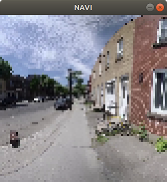

[](https://singularity-hub.org/collections/3288)

# SEVN

SEVN: Sidewalk Simulator Environment for Visual Navigation. An outdoor environment simulator with real-world imagery for Deep Reinforcement Learning on navigation tasks.



## Requirements

In order to install requirements, follow:

```bash
# PyTorch
conda install pytorch torchvision -c soumith

pip install tensorflow

# Baselines for Atari preprocessing
git clone https://github.com/openai/baselines.git
cd baselines
pip install -e .
cd ..

# Install env
git clone https://github.com/mweiss17/SEVN.git
cd SEVN
pip install -e .
```

## Dataset
You can dowload the dataset here: 
- [Low resolution](http://sevn.s3.amazonaws.com/dataset.zip)
- [High resolution](https://sevn.s3.amazonaws.com/SEVN-high-res-images.zip)

### Dataset pre-processing
For more information about the data-preprocessing and the data format consult the `README` in the [SEVN-data](https://github.com/simonchamorro/SEVN-data) github repository.

## Training
For more information about how to train an agent on SEVN consult the `README` in the [a2c_ppo_acktr](https://github.com/simonchamorro/pytorch-a2c-ppo-acktr-gail/tree/master/a2c_ppo_acktr) github repository.

### To play
```
python scripts/01-play.py
```

## For more information
[Creating a Navigation Assistant for the Visually Impaired](https://github.com/mweiss17/SEVN/blob/master/docs/01-article-env-introduction.md)


## Things that are currently broken:

- scripts/01-play.py uses outdated `meta.hdf5`
- env.render("human") currently doesn't work, because the render function requires some "first_time" and "clear" parameters
