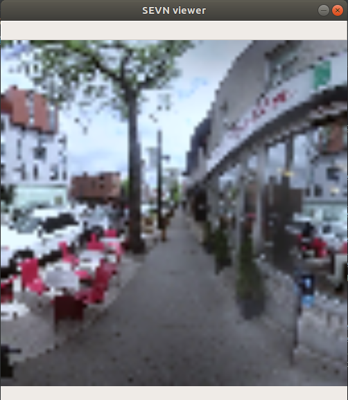

[](https://singularity-hub.org/collections/3288)

# SEVN: A Sidewalk Environment for Visual Navigation

SEVN contains 360<sup>0</sup> images and labels for house numbers, doors, and street name signs, which can be used for several different navigation tasks.
Agents trained with SEVN have access to variable resolution images, visible text, and simulated GPS data to navigate the environment. 
The SEVN Simulator is based on the OpenAI Gym environment. An instance of the simulator using low-resolution imagery can be run at 400-800 frames per second on a machine with 2 CPU cores and 2 GB of RAM.

Low Resolution Views (84x84px)             |  High Resolution Views (1280x1280px)
:-------------------------:|:-------------------------:
  |  


4,988 panoramic images across 6.3 kilometers with 3,259 labels on house numbers, doors, and street name signs.
## Installation

In order to setup the environment, follow this script
```bash
# Install the code
git clone https://github.com/mweiss17/SEVN.git
cd SEVN

# Create a new conda environment for the depenencies
conda create -n sevn python=3.7

# Install the dependencies
pip install -e .

# Download the low resolution image data, labels, and spatial graph
python scripts/download.py

# Test that your environment is correctly setup
python scripts/01-play.py

# WARNING! Running this step downloads 48GB of image data and is not required to run the model or play with the environment.
# python scripts/download.py --high-res
# python scripts/01-play.py --high-res

```

## Dataset
You can manually download the dataset here (in case you don't want to follow the installation instructions above).
- [Low resolution](http://sevn.s3.amazonaws.com/dataset.zip)
- [High resolution](https://sevn.s3.amazonaws.com/SEVN-high-res-images.zip) (Warning! 48 GB of images)

### Dataset pre-processing
For more information about the data-preprocessing and the data format consult the `README` in the [SEVN-data](https://github.com/simonchamorro/SEVN-data) github repository.

## Training
For more information about how to train an agent on SEVN consult the `README` in the [a2c_ppo_acktr](https://github.com/simonchamorro/SEVN-model/tree/master/sevn_model) github repository.

## For more information
[Creating a Navigation Assistant for the Visually Impaired](https://github.com/mweiss17/SEVN/blob/master/docs/01-article-env-introduction.md)


## Built With

* [OpenAI Gym](https://github.com/openai/gym) - A toolkit for developing and comparing reinforcement learning algorithms


## Authors
Martin Weiss, Simon Chamorro, Roger Girgis, Margaux Luck, Samira Ebrahimi Kahou, Joseph Paul Cohen, Derek Nowrouzezahrai, Doina Precup, Florian Golemo, Chris Pal

## License

This project is licensed under ...?
 
## Acknowledgments

* Hat tip to anyone whose code was used
* Inspiration
* etc
