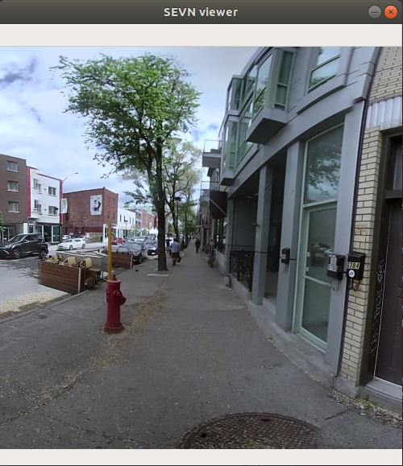

---
title: Examples
layout: default
filename: examples.md
--- 

# Examples
Here are a few examples from the SEVN dataset.

## Blurred Faces and License Plates
We blurred license plates and faces across the entire dataset.
{: .center-image }

## 84x84 pixel image
If you use the viewer in the [SEVN repository](github.com/mweiss17/SEVN), you'll see something like this.

## 1920x1280 pixel image
If you use the `--high-res` flag, you'll see something like this, after downloading the ~50Gb of image data.

# Connectivity Graph
These images are connected with an underlying spatial graph. Plotting this data on OpenCarta standard looks like this:

# Zones
The same neighborhood, with municipal zoning laws, where purple:commercial, yellow:residential, dark green: industrial. 

Here are example images taken from these regions.
## Residential

## Commercial

## Industrial

